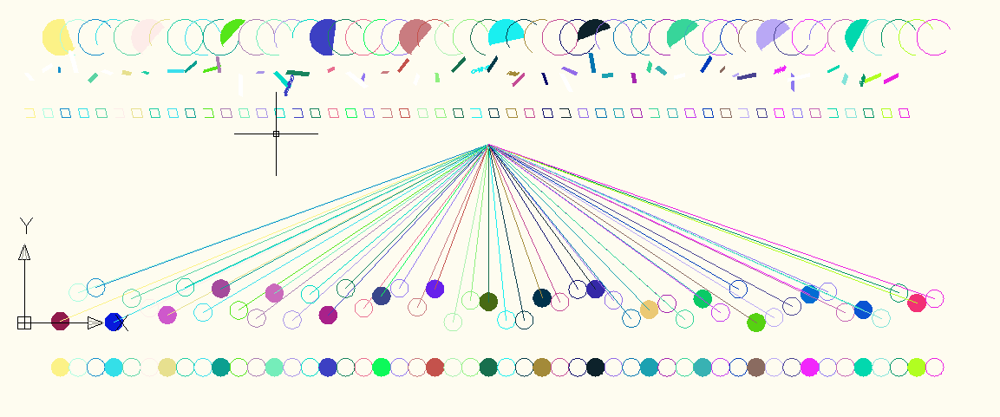

## dxf_reduce

dxf文件处理库，可以创建、加载dxf文件，并向其中添加新的图元。目前可以添加进去的图元有：
+ Arc
+ Circle
+ Line
+ LwPolyLine
+ Text
+ Ellipse
+ Ray

支持对图元进行填充的图元有
+ Arc
+ Circle
+ LwPolyLine

有待加入的图元有
+ 3DFACE
+ 3DSOLID
+ ACAD_PROXY_ENTITY
+ ATTDEF
+ ATTRIB
+ BODY
+ DIMENSION
+ HELIX
+ IMAGE
+ INSERT
+ LEADER
+ LIGHT
+ MLINE
+ MULTILEADER
+ MLEADERSTYLE
+ MTEXT
+ OLEFRAME
+ OLE2FRAME
+ POINT
+ POLYLINE
+ REGION
+ SECTION
+ SEQEND
+ SHAPE
+ SPLINE
+ SUBDIVISION
+ SUN
+ SURFACE
+ TABLE
+ TOLERANCE
+ TRACE
+ UNDERLAY
+ VERTEX
+ VIEWPORT
+ WIPEOUT
+ XLINE


### 使用：
#### 1. 创建一个新的dxf文件
```java
import com.bjak.dxfreduce.DxfDocWriter;
import com.bjak.dxfreduce.entity.DxfCircle;
public class TestCreateDxf {
    public static void main(String[] args) {
        Random random = new Random();
        try (DxfDocWriter dxfDocWriter = new DxfDocument()) {
            for (int i = 0; i < 50; i++) {
                Color randomColor = new Color(random.nextInt(255), random.nextInt(255), random.nextInt(255));
                LineWidth lineWidth = LineWidth.values()[random.nextInt(LineWidth.values().length)];
                Vector3 center = new Vector3(200 + i * 100, random.nextInt(200), 100);
                // 添加圆形
                DxfCircle dxfCircle = new Circle(center, 50);
                // 设置线宽
                dxfCircle.setLineWidth(lineWidth);
                // 设置颜色
                dxfCircle.setColor(randomColor);
                // 设置是否进行填充
                dxfCircle.setSolid(i % 3 == 0);
                // 设置填充的颜色
                dxfCircle.setSolidColor(new Color(random.nextInt(255), random.nextInt(255), random.nextInt(255)));
                // 添加图元
                dxfDocWriter.addEntity(dxfCircle);

                // 添加线段
                DxfLine dxfLine = new Line(new Vector3(2600, 1000, 100), center);
                dxfLine.setColor(randomColor);
                dxfLine.setLineWidth(lineWidth);
                dxfDocWriter.addEntity(dxfLine);

                // 添加多线段
                DxfLwPolyLine dxfLwPolyLine = new LwPolyLine();
                // 添加多线段各个顶点
                dxfLwPolyLine.addPoint(new Vector2(i * 100, 1200));
                dxfLwPolyLine.addPoint(new Vector2(50 + i * 100, 1200));
                dxfLwPolyLine.addPoint(new Vector2(60 + i * 100, 1200 - 50));
                dxfLwPolyLine.addPoint(new Vector2(10 + i * 100, 1200 - 50));
                // 设置是否是闭合图形
                dxfLwPolyLine.setClose(i % 5 != 0);
                dxfLwPolyLine.setLineWidth(lineWidth);
                dxfLwPolyLine.setColor(randomColor);
                dxfDocWriter.addEntity(dxfLwPolyLine);

                // 添加文字
                DxfText dxfText = new Text();
                dxfText.setText((char) (65 + random.nextInt(26)) + "哈哈");
                // 设置旋转角度
                dxfText.setAngle(random.nextInt(360));
                // 设置高度
                dxfText.setHigh(10 + random.nextInt(10));
                // 设置倾斜角度
                dxfText.setInclination(random.nextInt(45));
                // 设置宽度
                dxfText.setWidth(1 + random.nextInt(2));
                dxfText.setColor(randomColor);
                // 设置绘制点位置
                dxfText.setStartPoint(new Vector3(i * 100, 1400, 100));
                dxfDocWriter.addEntity(dxfText);

                // 添加弧形
                DxfArc dxfArc = new Arc();
                dxfArc.setCenter(new Vector3(200 + i * 100, 1600, 100));
                dxfArc.setRadius(100);
                dxfArc.setStartAngle(random.nextInt(90));
                dxfArc.setEndAngle(180 + random.nextInt(180));
                dxfArc.setColor(randomColor);
                dxfArc.setLineWidth(lineWidth);
                dxfArc.setSolid(i % 5 == 0);
                dxfDocWriter.addEntity(dxfArc);
            }
            String generateNewDxf = "E:\\testDxf\\test_empty_generate.dxf";
            String entitiesFilePath = "E:\\testDxf\\test_empty_generate_entities.dxf";
            // 保存dxf文件
            dxfDocWriter.save(generateNewDxf, true);
            // 仅仅保存图元信息
            dxfDocWriter.saveEntities(entitiesFilePath, true);
        } catch (IOException e) {
            e.printStackTrace();
        }

    }
}
```

#### 2. 加载一个已经存在的文件
```java
import com.bjak.dxfreduce.DxfDocWriter;
public class TestCreateDxf {

    public static void main(String[] args) {
        try (DxfDocWriter dxfDocWriter = new DxfDocument(path)) {
            // body code, same as before code
        } catch (IOException e) {
            e.printStackTrace();
        }

    }
}
```

#### 3. 存储的dxf文件示例
